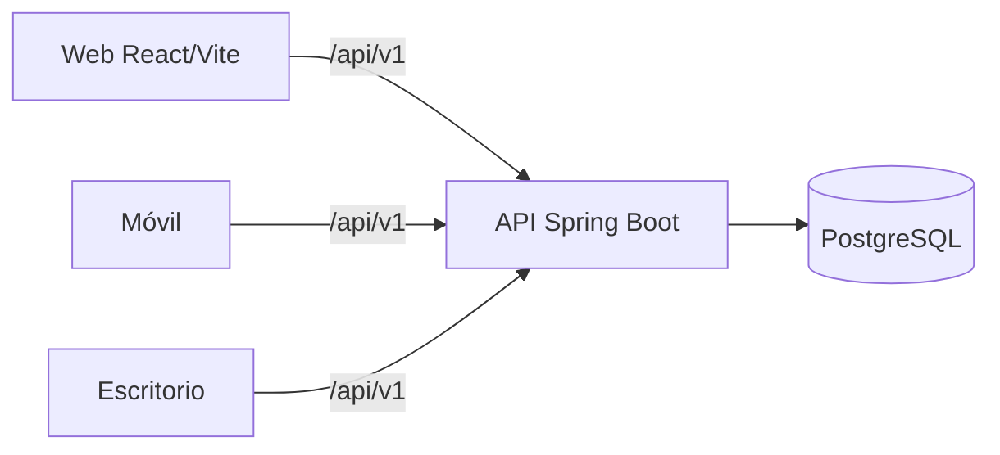

# Resumen Visual

## Arquitectura Actual

## Flujo

1. La web consume la API compartida.
2. La API valida JWT y permisos.
3. Los datos se guardan en PostgreSQL.
4. Los otros clientes leen la misma información.

## Módulos

- Autenticación
- Condominios e infraestructura
- Residentes y personas
- Tickets
- Comunicados
- Finanzas

## Stack

- Frontend: React + Vite
- Backend: Spring Boot + Spring Security
- Base de datos: PostgreSQL
- API: `/api/v1`
